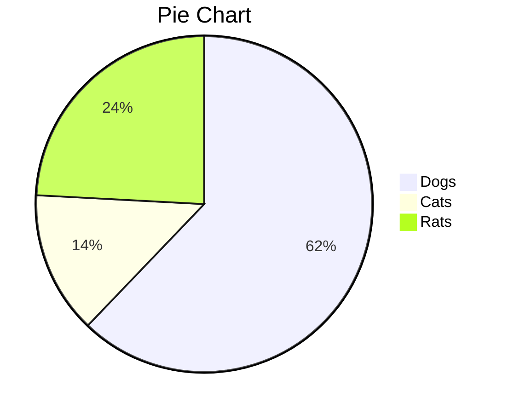

<!--
 * @author: biao.zhu@going-link.com
 * @Date: 2024-07-08 20:28:38
 * @LastEditTime: 2024-07-24 20:59:54
 * @Description: 复盘系列
 * @copyright: Copyright (c) 2020, Hand
-->
<!-- **推荐汽车系列**

性价比：
海鸥
海豚
海豹

耐撞：
坦克700
坦克 50

五菱宏光小mini -> 海鸥 -->
## 笔记系列
>以前都是凭喜好和感觉来操作，感觉不能在这样下去了，需要记录并定期复盘投资笔记
* 07/22

#### 目前配置

<!-- ---
hello: world
---

<script setup>
import { ref } from 'vue'

const count = ref(0)
</script>

## Markdown Content

The count is: {{ count }}

<button :class="$style.button" @click="count++">Increment</button>

<style module>
.button {
  color: red;
  font-weight: bold;
}
</style> -->


| Tables        |      Are      |  Cool |
| ------------- | :-----------: | ----: |
| col 3 is      | right-aligned | $1600 |
| col 2 is      |   centered    |   $12 |
| zebra stripes |   are neat    |    $1 |


```sequence
Alice->Bob: Hello Bob, how are you?
Note right of Bob: Bob thinks
Bob-->Alice: I am good thanks!
```





美股：**$500**  
正股  
期权  

币圈：**$1600**  
**现货 LDO**  
- 持仓情况：$360 **22%** 成本1.8。  
- 购买原因：盘面较规律，适合波段。  
- 卖出预期：预期价格 2.5。  
- 波段操作：是，日常可1.5以下适量买入，2以上适量卖出，波段资金操作占比 20%。【1.3 - 4】  

A股：**¥100000**  

**科博达**：  
- 持仓情况：9手 **50%** 目前成本 57。  
- 购买原因：盘面很规律，流通正常，7月份股票解禁价格大幅下降，公司发展情况不错。  
- 卖出预期：预期价格 72，预计需要2-3个月 也就是10月份。  
- 波段操作：是，日常可52以下适量买入，57以上适量卖出，波段资金操作占比 20%。【50 - 75】。    

- 变更记录：  
  07/24 科博达跌至50 加了2手

**五粮液**：  
- 持仓情况：2手 **25%** 目前成本 127。  
- 购买原因：无。  
- 卖出预期：无法判断。  
- 波段操作：无。

**同方股份**：  
- 持仓情况：20手 10% 目前成本 4.861。  
- 购买原因：成本较低，亏损可能性小。  
- 卖出预期：无法判断。  
- 波段操作：无。  
- 变更记录：  
  07/24 同方股份 略亏出售1500 只留500 
    
基金：¥8000
- 纳指：  
  - 持仓情况：8000 目前收益率 4  
  - 购买原因：无  
  - 卖出预期：无  
        
总计  **$500 + $1600 + ¥100000 + ¥8000**  
    
---
**因子**

心态：
- why：有良好的心态可以静下来思考市场， 这是阻止我们进行风险 
- how：  
        1.只操作闲置资金，这样持有正股时才不会被市场的各种拉扯 而操作变形。  
        2.避免接触合约，期权。大赚大亏都很影响心态。美股的期权已经亏了2000刀。  
        3.减少交易次数，交易前三思。机会是等来的，而不是通过广撒网撒出来的。  
        4.盈利很多时，只操作收益部分  

策略：次要，伴生要求 执行力  
- what： 交易系统
- how： 良好的仓位管理，分散配置

消息：关注国内外重大消息，并从消息中提取有效信息  

认知：需要不断提高。  

以上总结我的学习认知：心态 > 策略 > 消息  
而我们需要的是一个良好的心态，可执行的策略，关注不同圈子的消息。当然，有时候可靠的消息胜过一切，但是这注定可遇不可求。如果遇到了，不妨all in。


